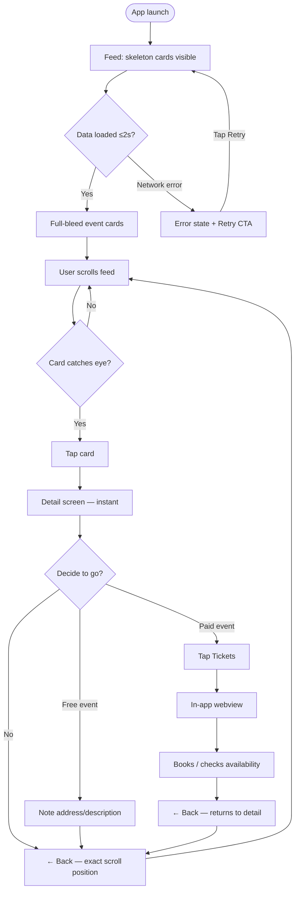
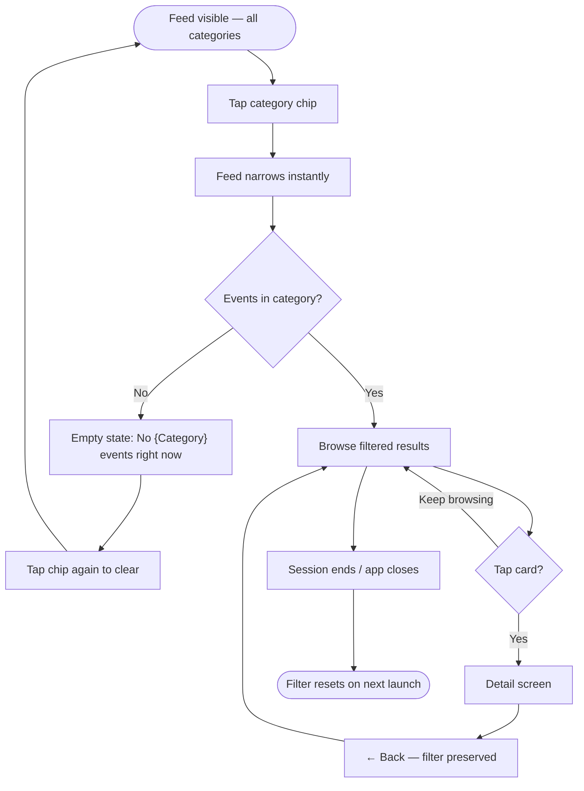
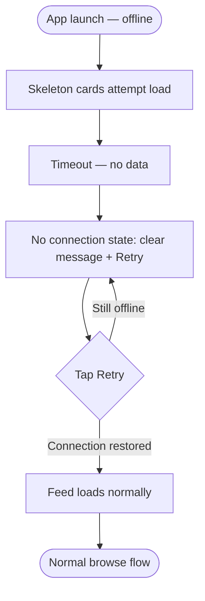

# UX Design Specification — Event Board ZA
**Author:** Voice.mijalkovic
**Date:** 2026-05-26

---
<!-- UX design content will be appended sequentially through collaborative workflow steps -->

## Executive Summary

### Project Vision

Event Board ZA is a single-purpose mobile app: answer "what's on in JHB?" in under 10 seconds. The entire UX philosophy flows from that — minimal friction, no account gate, immediate value on launch. Aesthetic reference is the Fever app: polished, event-image-led, premium feel. Two screens, flat navigation — that is the entire app. It launches free and ad-supported in Johannesburg, with a clear v2 path to other SA cities once the model is proven.

### Target Users

**Primary: The JHB Social Planner** — smartphone-native, late 20s to mid-40s, plans weekends and evenings with a partner or friend group. Currently cobbles together answers from Google, Facebook Events, and whatsoninjoburg.com. Frustrated that no single place exists. The product founder is the canonical instance, which is a UX advantage: strong, accurate intuition about what the user actually needs.

**Jobs To Be Done (UX-relevant):**
- Find events happening this weekend/month without doing research
- Filter by type when in a specific mood (e.g. "I want a market, not a concert")
- Get just enough detail to decide whether to go, then reach the ticket link fast
- Feel informed about their city — not like they're missing out

### Key Design Challenges

1. **Ad integration without destroying the experience** — AdMob banners every 5–7 cards is the revenue model, but a premium Fever-like feel requires ads that don't feel intrusive. Card rhythm and visual hierarchy must absorb ads gracefully without breaking the scroll flow.

2. **Category placeholder quality** — Most events won't have professional imagery at launch. Category placeholders will appear constantly. If they look generic or cheap, the "premium feel" goal collapses immediately. This is the single highest-stakes visual decision in the entire app.

3. **Event card density vs. scannability** — Cards must show enough (name + date + venue) to enable a 1-second yes/no decision, while staying visually clean on small screens. Getting the typographic hierarchy right is the core card design challenge.

### Design Opportunities

1. **The 10-second test as a differentiator** — Every competitor fails it. If this app genuinely surfaces the right event in one scroll and one tap, the UX itself becomes the product's competitive advantage. Flow speed is worth designing explicitly.

2. **Category filter chips as a delight moment** — A horizontal scrollable chip row that feels native and satisfying (clear active state, smooth feedback) is a small interaction that signals quality throughout the app.

3. **Skeleton loading as a first impression** — Since content loads from Firestore, the loading state is the first impression for new users. Skeleton cards that match the real card shape make the app feel fast even when it isn't.

## Core User Experience

### Defining Experience

The core user action is: **open → scroll → tap → decide → go**. Five beats. The whole product is optimised to make those five beats take under 10 seconds. Everything else is secondary. The card feed is the entire product; the detail view is a confirmation screen; the ticket link is the exit ramp.

### Platform Strategy

Mobile-only, touch-first, iOS + Android. React Native / Expo SDK 56. No offline event caching in v1 — clear "no connection" state instead of a crash or blank screen. No device capabilities beyond standard touch in v1 (no camera, no location, no push notifications).

### Effortless Interactions

- **Instant first screen** — no splash, no onboarding, no account prompt. Feed is the first pixel the user sees on launch.
- **One-tap filter** — tap a chip, feed narrows immediately. Tap again to clear. No confirmation, no "apply" button.
- **Back = exact scroll position** — return from detail view and land exactly where you left off. Zero disorientation.
- **Ticket link stays in-app** — webview with a back control. User never loses their place in the app.

### Critical Success Moments

1. **First launch** — Feed loads with real events in ≤2 seconds. If this fails, the app has no second chance with a new user.
2. **The scroll-and-spot moment** — User sees an event card at a glance and thinks "oh, that looks good." This is the core value delivered. Card design (image quality, typographic hierarchy, scannability) determines whether this moment happens.
3. **The ticket tap** — User taps the ticket link. This is SM-4 (target ≥20% of detail views). It proves the app created actionable intent, not just browsing.

### Experience Principles

1. **Speed is the feature** — Every interaction must feel instant. Skeleton cards, no loading spinners on critical paths.
2. **Two taps to value** — Open app → tap card → you're looking at the full event detail. That is the minimum viable path and it must always work.
3. **Content leads, chrome recedes** — Event imagery and typography carry the weight. Navigation, ads, and UI structure should be invisible when possible.
4. **Confident defaults** — Chronological sort, all categories, JHB scope. The app makes decisions so the user doesn't have to configure anything to get value on first open.

## Desired Emotional Response

### Primary Emotional Goals

- **In-the-know** — the opposite of FOMO. The app should make users feel plugged in to JHB's scene, not anxious about what they might be missing. This is the emotional outcome the whole product is built to deliver.
- **Confident** — "I know what we're doing Saturday." Users should leave a session with a decision, not more tabs open.
- **Locally connected** — a subtle sense that this app is *for* JHB, not a generic events aggregator that happens to include JHB results. Tone and content signal this.

### Emotional Journey Mapping

| Moment | Target Feeling |
|--------|---------------|
| First launch | Curiosity → immediate satisfaction (real events, fast) |
| Scrolling the feed | Discovery — "oh, I didn't know about that" |
| Tapping a card | Interest → confirmation (detail view validates the tap) |
| Tapping ticket link | Intent → action (I'm going to this) |
| Error / no connection | Informed, not abandoned — clear message, retry visible |
| Return visit | Anticipation — what's new this week? |

### Micro-Emotions

- **Trust** — events must feel real, current, accurate. Stale or cancelled events would destroy this completely.
- **Delight** — beautiful event imagery, smooth filter chip interaction, skeleton-to-content transitions.
- **Accomplishment** — finding the right event and acting on it. The ticket tap is the completion moment.
- **Avoid: overwhelm** — too many events with no signal hierarchy feels like scrolling Facebook. Chronological order + single-select filter is the antidote.
- **Avoid: skepticism** — broken images, missing venues, or "event not found" destroy confidence fast.

### Design Implications

- **In-the-know → content freshness signals** — contextual date grouping ("This Weekend", "This Week") makes the feed feel live, not static.
- **Confident → decisive copy** — "Tickets" not "Get Tickets Here". "Free" not "No ticket required". Single clear CTA per detail view.
- **Local identity → tone** — "What's on in JHB" in headers. Venue names, not generic addresses. Copy that feels like a local wrote it.
- **Trust → no broken states** — category placeholders must look intentional, not fallback. Graceful handling when fields are missing. No dead ticket links.
- **Delight → transitions** — skeleton cards animate to content smoothly. Filter chips have a satisfying active state. Back navigation is instant.

### Emotional Design Principles

1. **Cure FOMO, don't create it** — content quality and freshness are non-negotiable; a feed full of stale events inverts the emotional goal entirely.
2. **Every broken state is an emotional failure** — error states, missing images, and absent fields all erode trust; each one must be designed as carefully as the happy path.
3. **Local first, always** — copy, tone, and content signals should remind the user this app was built for JHB, not adapted for it.

## UX Pattern Analysis & Inspiration

### Inspiring Products Analysis

**Fever (primary reference)**
- Cards are full-bleed image tiles; event imagery is the entire card. Text overlays are minimal (name + date only at card level).
- Discovery is the entire app — no social graph, no friend activity, pure curation.
- Navigation is flat: feed → detail → back. No hamburger, no bottom tabs for the core flow.
- "Curated" feel comes from editorial imagery selection, not algorithmic personalisation.

**Airbnb (adjacent reference)**
- Clean image-led cards with a tight 3-line hierarchy (title, location, price). Information density per card is exactly right.
- Card proportions and typographic scale are a useful starting point for our event cards.

**Resident Advisor / RA (adjacent reference)**
- Events discovery app for the music community. Excellent filter chip UX and event detail page hierarchy.
- Date/venue/price treatment in detail views is a strong model regardless of the different aesthetic direction.

**Headspace / Calm (feel reference)**
- Not events apps, but both achieve a "premium, unhurried" feel through generous whitespace and restrained colour palettes.
- Spacing rhythm as an emotional signal — transferable to our feed card spacing.

### Anti-References

**Eventbrite (too corporate)**
- Lists events like a database: text rows, small thumbnails, joyless. Designed for organisers as much as attendees — that tension shows everywhere.
- Heavy navigation chrome: persistent tabs, search bar, location prompt, always-visible filters.

**Facebook Events (too noisy)**
- Social graph injected everywhere: "X friends are going", RSVPs, comments. Discovery buried under social feeds.
- Event quality wildly inconsistent with no curation signal.

**Government/city guides (too flat)**
- No design investment; purely functional information architecture with no emotional design.

### Transferable UX Patterns

**Navigation:**
- Flat two-level structure (feed → detail → back) from Fever — no hamburger, no persistent tabs
- Scroll position preservation on back navigation — eliminates disorientation

**Interaction:**
- Single-select filter chips with unambiguous active/inactive state — instant visual feedback, no "apply" button
- Full-bleed image cards with minimal text overlay at card level — all detail deferred to the detail view

**Visual:**
- Airbnb-style card proportions: image dominant, tight 3-line text hierarchy below
- RA-style detail page: date, venue, price as a scannable block before the description
- Generous whitespace between cards as a spacing rhythm signal (Headspace/Calm influence)

### Anti-Patterns to Avoid

- **"Discover" tab trap** — adding a secondary tab alongside the main feed creates decision paralysis and dilutes the core flow. Our two-screen structure explicitly avoids this.
- **Interstitial before value** — showing a full-screen ad before the user has seen any events inverts the trust-building sequence. At minimum one full feed scroll before any interstitial fires.
- **Placeholder-as-fallback** — grey boxes or broken image icons where event art should be. Category placeholders must be designed assets, not CSS fallbacks.
- **Filter state ambiguity** — chips that look "possibly active". Active state must be unambiguous at a glance (colour, weight, or both).
- **Social signals in the feed** — "3 people are interested" noise. Not on roadmap, and must never creep in.

### Design Inspiration Strategy

**Adopt directly:**
- Fever's full-bleed card format and flat two-level navigation
- RA's event detail page information hierarchy (date/venue/price block)
- Airbnb's card typographic scale and proportions

**Adapt:**
- Fever's curated aesthetic → apply to a higher-volume, less editorially-controlled feed via strong category placeholder design
- RA's filter chips → simplify to single-select (RA allows multi-select) to match our PRD constraint

**Avoid entirely:**
- Eventbrite's organiser-centric information architecture
- Facebook Events' social proof and notification-driven engagement
- Any navigation pattern that adds chrome between the user and the event content

## Design System Foundation

### Design System Choice

**NativeWind v4** (Tailwind CSS for React Native) — utility-first styling with custom design tokens. This is the "themeable system" approach: Tailwind's proven spacing, typography, and colour primitives, overridden with project-specific tokens to produce a Fever-like premium aesthetic rather than a generic Tailwind look.

### Rationale for Selection

- Solo founder, design-centric product — iterating on `className="..."` is dramatically faster than rewriting StyleSheet objects for every visual adjustment
- No design system component opinions forcing our visual direction (no Material Design cards, no NativeBase defaults)
- Tailwind's spacing and typography scale provides consistent rhythm out of the box
- NativeWind v4 supports dark mode via `dark:` variants with no extra setup
- Aligns with the confirmed architecture decision (Expo SDK 56 + NativeWind v4)

### Design Tokens to Define

| Token category | Direction |
|----------------|-----------|
| **Colour palette** | Dark background (near-black), high-contrast white for primary text, accent colour for CTAs and active filter chips — finalised in step 7 |
| **Typography** | Single font family; strong weight hierarchy: bold event name, medium date, regular venue |
| **Spacing scale** | Tailwind defaults with overrides for card padding and feed gap |
| **Border radius** | Consistent radius on cards, chips, and webview modal |
| **Shadow/elevation** | Subtle card shadow; minimal on dark backgrounds |

### Custom Components to Build

| Component | Purpose |
|-----------|---------|
| `EventCard` | Core visual unit — full-bleed image + text overlay |
| `CategoryChip` | Filter chip with clear active/inactive states |
| `SkeletonCard` | Loading placeholder matching EventCard dimensions exactly |
| `CategoryPlaceholder` | Designed asset per category — intentional, not a CSS fallback |
| `WebViewModal` | In-app webview with back control for ticket links |

### Implementation Approach

All styling via NativeWind `className` props only — no inline `style` props, no StyleSheet objects in components. Design tokens defined in `tailwind.config.js` as custom theme extensions. Component library is entirely bespoke; no third-party UI component library introduced.

## Design Direction Decision

### Design Directions Explored

Four feed layout variations were explored using the Dark Warm palette and real JHB event content (see `ux-design-directions.html`):

1. **Full-Bleed Overlay** — image fills card, text overlaid at bottom with gradient
2. **Image Top + Text Block** — image top portion, dark surface text section below
3. **Compact Row** — thumbnail left, info right, high density
4. **Hero + Grid** — full-width hero first event, 2-column grid below

### Chosen Direction

**Direction 1: Full-Bleed Overlay**

Cards are full-width image fills with a bottom gradient and text overlay. No card borders, no text sections — the event image is the entire card.

### Design Rationale

Maximum visual impact per card. Closest to the Fever reference aesthetic. Images are the primary content signal; the layout makes them the full canvas. The warm dark gradient ensures text legibility regardless of image tone without introducing a separate text section that would reduce image impact.

### Implementation Approach

**Card spec:**
- Height: ~200px, full screen width, no horizontal margin
- Gradient overlay: `linear-gradient(to top, rgba(15,12,9,0.95) 0%, rgba(15,12,9,0.4) 60%, transparent 100%)`
- Overlay content: event name (18sp/700, `text-primary`) + date · venue (13sp/500, `text-secondary`) — left-aligned, bottom-anchored with 14px padding
- Feed gap between cards: 2px (near-seamless)

**Category placeholders:**
- Full-bleed gradient per category (not grey boxes)
- Category-specific colour direction + emoji/icon centred
- Must look intentional, not like a missing image

**Ad units:**
- Same full-width height as a card (~52px banner)
- Dark surface (`#1C1814`) background with "Ad" label and ad content
- Visually distinct but consistent with dark palette — no jarring white ad backgrounds

**Detail screen:**
- Full-width hero image: 220px
- Back button overlaid on hero image (top-left, semi-transparent pill)
- Scrollable body: category tag → event name → metadata block (date+time, venue+address, price/"Free") → description
- Sticky Tickets CTA at bottom: full-width, accent colour (`#FF6B35`), 48px height

## User Journey Flows

### UJ-1: Browse the Weekend Feed → Book



### UJ-2: Filter by Category



### UJ-3: No Connection



### Journey Patterns

| Pattern | Rule |
|---------|------|
| **Back = undo** | Back navigation always returns to exact previous state (scroll position, filter active). Never resets. |
| **Instant feedback** | Filter chip tap and card tap respond immediately — no loading indicator between tap and result. |
| **Retry is always available** | Every error/empty state has a visible, tappable recovery action. No dead ends. |
| **Session-scoped state** | Filter persists within session; resets on close. Webview closes back to detail, not to feed. |
| **No login gate anywhere** | No journey requires or prompts for an account at any point in v1. |

### Flow Optimisation Principles

1. **Minimum steps to value: 2** — launch → scroll → tap card. Ticket link adds 2 more (tap Tickets → webview) but those are post-decision, not pre-value.
2. **Dead-end elimination** — every terminal state (error, empty category, post-booking) has a clear next action visible without scrolling.
3. **Filter as power-user shortcut** — unfiltered feed is always the default. Filtering is optional narrowing, not required configuration.

## Component Strategy

### Design System Components

NativeWind v4 is utility-first (style tokens, not components). All UI components are custom-built from React Native primitives (`View`, `Text`, `Image`, `Pressable`, `FlatList`, `ScrollView`) styled with NativeWind `className` props. No third-party component library.

### Custom Components

#### `EventCard`
- **Purpose:** Core feed unit — communicates enough at a glance for a 1-second yes/no decision
- **Anatomy:** `Pressable` → full-bleed `Image` (or `CategoryPlaceholder`) → absolute gradient overlay → name + date · venue (bottom-left)
- **States:** default, pressed (0.93 scale), image loading (skeleton shimmer), image error (falls to `CategoryPlaceholder`)
- **Accessibility:** `accessibilityRole="button"`, `accessibilityLabel="{name}, {date}, {venue}"`

#### `CategoryPlaceholder`
- **Purpose:** Intentional full-bleed art when no event image exists — must look designed, not like a fallback
- **Variants:** One per category (8 total), each with a category-specific gradient + centred icon

| Category | Gradient |
|----------|----------|
| Music | `#1a0a1e → #3d1459` (deep purple) |
| Markets | `#1a1200 → #4a3000` (warm amber) |
| Food & Drink | `#1a0800 → #4a1a00` (burnt sienna) |
| Art & Culture | `#001a1a → #004040` (teal) |
| Sport | `#001a00 → #003300` (forest) |
| Comedy | `#1a1500 → #3d3000` (gold) |
| Nightlife | `#0d0020 → #200040` (midnight violet) |
| Family | `#001a0d → #003320` (emerald) |

#### `CategoryChip`
- **Purpose:** Single-select filter control
- **States:** inactive (surface bg, secondary text, border), active (accent bg, dark text, no border), pressed (scale 0.95)
- **Accessibility:** `accessibilityRole="button"`, `accessibilityState={{ selected: active }}`

#### `ChipsRow`
- **Purpose:** Horizontal scrollable container for All + 8 category chips
- **Anatomy:** `ScrollView` (horizontal, no scroll indicator) → `CategoryChip` × 9

#### `SkeletonCard`
- **Purpose:** Loading placeholder matching `EventCard` dimensions exactly for seamless transition
- **Anatomy:** Same height (~200px full-width) → pulsing shimmer (opacity 0.3→0.6→0.3, 1.2s Animated loop between `#1C1814` and `#2A2420`)

#### `EmptyState`
- **Purpose:** Non-blank fallback for empty category, no-connection, and error scenarios
- **Variants:** `empty-category` (clear filter hint), `no-connection` (Retry CTA), `error` (Retry CTA)

#### `WebViewModal`
- **Purpose:** In-app webview for ticket links — keeps user in the app
- **Anatomy:** Full-screen modal (slides up) → back button + URL hostname header → `WebView`

#### `AdBannerUnit`
- **Purpose:** AdMob banner wrapper in the feed
- **Anatomy:** `#1C1814` bg → "Ad" label (9px, secondary) → `BannerAd` from `react-native-google-mobile-ads`
- **Behaviour:** Zero height on failed load — no blank space

### Component Implementation Strategy

- All styling via NativeWind `className` only — no inline `style`, no StyleSheet objects in components
- Components accept typed props matching the Firestore `Event` schema from the architecture spec
- Pressable feedback via `scale` transform (no opacity changes on images — causes flicker)
- Accessibility labels on all interactive components (NFR-4)

### Implementation Roadmap

| Phase | Components | Feeds |
|-------|-----------|-------|
| Sprint 1 — Feed | `CategoryPlaceholder`, `EventCard`, `SkeletonCard`, `ChipsRow`, `CategoryChip` | FR-1, FR-2, FR-7 |
| Sprint 2 — Detail | `WebViewModal`, `EmptyState` | FR-4, FR-5, FR-3 |
| Sprint 3 — Ads | `AdBannerUnit` | FR-9, FR-10 |

## Defining Core Experience

### Defining Experience

**"Scroll → spot → tap → decide"**

The user is scrolling through the feed, a card catches their eye, and in under one second they think *"we should do that."* One tap confirms the details. One more gets them to the ticket page. Every design decision is in service of that moment.

### User Mental Model

Users arrive with a familiar mental model: the vertical card browse from Airbnb, Instagram, and booking apps. They expect cards to be scannable at scroll speed, tapping to cost them nothing (easy to go back), and the detail view to validate the decision they half-made on the card.

This is a **discovery** tool, not a **search** tool. Users browse in open mode — "show me what's on" — not with a specific event in mind. That mental model drives the entire hierarchy: feed first, filter as optional refinement, search not in scope for v1.

### Success Criteria

- Card imagery and text legible at scroll velocity — eye parses name + date without stopping
- Category filter narrows instantly with no perceptible lag — feels like a local UI change, not a network call
- Detail view appears before the user finishes reading the card thumbnail (navigation feels instant)
- Back navigation returns to exact scroll position — no reset, no disorientation, no hesitation to explore

### Novel vs. Established Patterns

Vertical card feeds are universal. Zero user education required. The innovation is editorial — what is *absent* from the feed (no social noise, no irrelevant listings, no configuration prompts) — not interactional. Users are productive from the first second.

### Experience Mechanics

| Phase | What happens |
|-------|-------------|
| **Initiation** | App opens → feed is immediately visible. No splash screen, no onboarding, no location prompt. |
| **Browse** | User scrolls vertically. Each card is a full-width image tile with event name, human-readable date, and venue name. Eye scans at scroll speed. |
| **Filter (optional)** | User taps a category chip. Feed narrows immediately. Active chip is visually distinct. Tap again to clear. |
| **Tap** | User taps a card. Navigation to detail view is immediate (pre-fetched via TanStack Query). |
| **Detail** | Full event info: image, name, date+time, venue+address, description, price/"Free", Tickets CTA. Absent fields omitted — no blank rows. |
| **Ticket** | User taps "Tickets" → in-app webview with back control. User books, taps back → returns to detail view. |
| **Back to feed** | User taps back from detail → returns to exact scroll position in feed. |
| **Error / empty** | No connection → clear message + retry. Empty category → "No [category] events right now", not blank screen. |

## Visual Design Foundation

### Colour System

**Option B: Dark Warm** — chosen for local JHB character over generic European nightlife palette.

```
Background:    #0F0C09  (near-black warm)
Surface:       #1C1814  (card/surface warm dark)
Primary text:  #F5F0E8  (warm white)
Secondary:     #8A7E70  (warm grey — dates, venues, labels)
Accent:        #FF6B35  (burnt orange — CTAs, active chips, highlights)
Border:        #2A2420  (subtle separators)
Error:         #FF4D4D
Success:       #4CAF50
```

`tailwind.config.js` custom token extensions:
```js
colors: {
  background: '#0F0C09',
  surface:    '#1C1814',
  'text-primary':   '#F5F0E8',
  'text-secondary': '#8A7E70',
  accent:  '#FF6B35',
  border:  '#2A2420',
  error:   '#FF4D4D',
  success: '#4CAF50',
}
```

### Typography System

- **Font family:** Inter via `@expo-google-fonts/inter`
- **Scale:**

| Role | Size | Weight | Usage |
|------|------|--------|-------|
| Event name (card + detail) | 18sp | 700 Bold | Primary identity of each card |
| Date | 13sp | 500 Medium | Card overlay + detail metadata |
| Venue | 13sp | 400 Regular | Card overlay + detail metadata |
| Detail body | 15sp | 400 Regular | Event description text |
| Chip label | 13sp | 500 Medium | Category filter chips |
| CTA | 16sp | 600 SemiBold | "Tickets" and primary action buttons |

### Spacing & Layout Foundation

- **Base unit:** 4px (Tailwind default scale)
- **Screen edge padding:** 16px (`px-4`)
- **Feed vertical gap between cards:** 12px (`gap-3`)
- **Card image height:** ~200px
- **Card text padding:** 12px (`p-3`)
- **Category chip row height:** 48px; gap between chips: 8px (`gap-2`)
- **Detail screen horizontal padding:** 16px (`px-4`)

### Accessibility Considerations

All colour combinations meet WCAG 2.1 AA (NFR-4):

| Foreground | Background | Ratio | Level |
|------------|------------|-------|-------|
| `#F5F0E8` (primary text) | `#0F0C09` | ~14:1 | AAA ✅ |
| `#8A7E70` (secondary text) | `#0F0C09` | ~4.6:1 | AA ✅ |
| `#FF6B35` (accent) | `#0F0C09` | ~5.1:1 | AA ✅ |
| `#F5F0E8` (primary text) | `#1C1814` (surface) | ~12:1 | AAA ✅ |

All interactive elements will carry `accessibilityLabel` and `accessibilityRole` props per architecture spec.

## UX Consistency Patterns

### Button Hierarchy

**Primary CTA**
- **When to use:** Single primary action per screen — `Tickets` on detail view only
- **Visual design:** Full-width, 48px height, `#FF6B35` accent bg, `#F5F0E8` text, 16sp/600 SemiBold, 8px border radius — sticky at screen bottom with safe area inset
- **Behaviour:** Taps open ticket URL in `WebViewModal`. If no URL exists, button is replaced by the no-ticket label — never shown disabled
- **Accessibility:** `accessibilityRole="button"`, `accessibilityLabel="Get tickets for {event name}"`

**No Ticket Label (CTA area substitute)**
- **When to use:** Event has no ticket link
- **Visual design:** Sticky bottom area retained; non-interactive label only — `text-secondary` (`#8A7E70`), 13sp/400, centred
- **Copy:** "No tickets required"

**Secondary Action — Retry / Clear filter**
- **When to use:** Error states, empty category — recovery only
- **Visual design:** Pill/text-style — `#2A2420` bg, `#F5F0E8` text, 13sp/500 Medium, 20px border radius, 16px horizontal padding, 36px height — never full-width
- **Behaviour:** Triggers re-fetch or clears filter depending on context

**Rule:** One primary CTA per screen maximum. Secondary actions never compete with it visually.

---

### Loading Patterns

**Initial Feed Load**
- **Skeleton count:** Always 3 `SkeletonCard` components — fixed, no viewport calculation
- **ChipsRow on first load:** Chips also render as skeletons — full-screen shimmer until first data lands
- **Shimmer animation:** Opacity pulse `0.3 → 0.6 → 0.3`, 1.2s `Animated` loop, between `#1C1814` and `#2A2420`
- **Transition:** Skeletons fade out, real cards fade in — no layout jump (skeleton dimensions match card exactly)
- **Accessibility:** `accessibilityLabel="Loading events"` on skeleton container

**Subsequent Loads (pagination)**
- Real cards stay visible; skeletons append at list bottom during load — no full-screen shimmer

**Ad Units**
- `AdBannerUnit` renders at zero height until ad content resolves — no blank space, no layout shift

---

### Empty & Error States

All three states share a centred 3-part layout (icon → heading → subtext → action) in the content area below the chips row.

**Empty Category**
- **Icon:** Category emoji at 32px (e.g. 🎵 for Music)
- **Heading:** "No [Category] events right now" — 18sp/600
- **Subtext:** "Try a different category or check back later" — 13sp/400, `text-secondary`
- **Action:** "Clear filter" pill → deselects active chip, resets feed to all events

**No Connection**
- **Icon:** Signal-off icon, outline, 32px, `text-secondary`
- **Heading:** "No connection" — 18sp/600
- **Subtext:** "Check your signal and try again" — 13sp/400, `text-secondary`
- **Action:** "Retry" pill → re-triggers data fetch

**General Error** (visually distinct from no-connection)
- **Icon:** Alert/warning triangle, outline, 32px, `#FF4D4D` — differentiates from signal-off at a glance
- **Heading:** "Something went wrong" — 18sp/600
- **Subtext:** "Try again or check back later" — 13sp/400, `text-secondary`
- **Action:** "Retry" pill → re-triggers data fetch

**Rule:** No blank screens, no dead ends. Every terminal state has a visible recovery action without scrolling.

---

### Navigation Patterns

**Feed → Detail**
- Native stack push (slide-in from right); scroll position frozen and restored exactly on back
- Data pre-fetched via TanStack Query on card render — navigation feels instant

**Back (always undo)**
- Stack pop (slide-out right); scroll position and filter state restored — never resets either
- Rule: Back is always undo. No exceptions.

**Detail → WebViewModal**
- Modal slides up from bottom (sheet pattern)
- Back control: pill button top-left overlaid on webview — always exits modal entirely, never steps back within webview browser history
- On close: returns to detail view, not feed

**App Backgrounding / Foreground**
- On foreground: feed resets to top; soft refresh triggers in background — user lands at top with fresh content
- Active category filter: persists through backgrounding (session-scoped state survives)

---

### Filtering Patterns

**Chip Row Layout**
- "All" chip: pinned left — always visible, never scrolls off-screen
- Category chips (×8): scroll freely behind "All" — no fade indicator, no scrollbar

**Single-Select Behaviour**
- Tap inactive chip → activates, feed narrows instantly
- Tap active chip again → deactivates, feed returns to all
- Tap "All" → any active chip deactivates, feed returns to all
- Mutual exclusion: only one chip active at a time

**Active State Visuals**
- Active: `#FF6B35` bg, `#0F0C09` text, no border
- Inactive: `#1C1814` bg, `#F5F0E8` text, 1px `#2A2420` border
- Pressed (both states): scale 0.95 transform

**State Recall Animation**
- On return from detail while a chip is active: brief scale pulse (1.0 → 1.05 → 1.0, 200ms) — confirms filter state was preserved

**Session Persistence**
- Persists within session (survives backgrounding); resets to "All" on app close/reopen (FR-8)

## Responsive Design & Accessibility

### Responsive Strategy

Event Board ZA is a **mobile-only** React Native app. No web, desktop, or tablet-specific layout is in scope. The responsive strategy is narrow and deliberate: design for a single-column, touch-first layout that works across the full range of modern Android and iOS phone screen sizes.

**Platform scope:**
- iOS 15.0+ (iPhone only — no iPad-specific layout)
- Android 9.0+ / API 28 (phones — single column on tablets too)
- Single codebase, single layout — no breakpoint-driven column changes

**Tablet behaviour:**
- App will run on iPads and Android tablets
- No 2-column adaptation — cards stretch full width of the tablet screen
- Accepted trade-off: sub-optimal on large screens, zero additional layout complexity

---

### Breakpoint Strategy

React Native uses density-independent pixels (dp/pt), not CSS pixels. No web-style media query breakpoints.

**Design target:** 390pt wide (iPhone 14 / most modern Android flagships)

**Supported range:**

| Device | Width | Behaviour |
|--------|-------|-----------|
| iPhone SE (3rd gen) | 375pt | Slightly tighter — layout holds, no layout-specific adaptation |
| iPhone 14 / most Android | 390–412dp | Design target |
| iPhone 14 Pro Max | 430pt | Cards stretch wider — still single column, no change |
| Tablets | 600dp+ | Single column, full-width cards — no adaptation |

**Implementation rule:** All dimensions in dp/pt only — no hardcoded pixel values. Cards use `width: '100%'` — they fill whatever the container provides. Horizontal padding (`px-4` = 16pt) is the only layout constraint.

**Width-dependent logic:** Use `Dimensions.get('window').width` only if a specific value is needed (e.g. calculating skeleton card height ratio). Prefer `flex` and percentage-based sizing everywhere else.

---

### Accessibility Strategy

**Target compliance:** WCAG 2.1 AA (NFR-4 — already committed)

**Colour contrast:** All combinations verified in visual foundation (Section: Visual Design Foundation). Minimum ratio 4.6:1 for secondary text — AA compliant.

**Touch targets:**
- Minimum 44×44pt (iOS HIG) / 48×48dp (Android Material)
- All `Pressable` wrappers enforce `minHeight: 44` — chips, cards, Retry pill, Tickets CTA, WebView back button
- CategoryChip row height already set at 48px — compliant

**Dynamic text sizing:**
- `allowFontScaling={true}` on all `Text` components (React Native default — do not opt out)
- Layout must absorb text scaling: use flex-based containers, avoid fixed-height text rows
- EventCard overlay: if event name scales beyond 2 lines, clip with `numberOfLines={2}` + `ellipsizeMode="tail"` — prevents gradient overflow

**Screen readers:**
- VoiceOver (iOS) + TalkBack (Android) supported
- All interactive components carry `accessibilityRole` and `accessibilityLabel` (defined per component in Component Strategy)
- Feed `FlatList`: `accessible={false}` on the list itself — screen reader navigates individual cards, not the container
- Skeleton cards: `accessibilityLabel="Loading events"` on wrapper, `importantForAccessibility="no"` on shimmer children

**Focus & navigation order:**
- React Native manages focus order by render order — component tree order matches logical reading order
- No custom focus management required for this app's 2-screen structure
- WebViewModal: focus traps inside modal when open; returns to "Tickets" button on close

---

### Testing Strategy

**Device testing targets:**

| Device | Why |
|--------|-----|
| iPhone SE (375pt) | Smallest supported iOS screen |
| iPhone 14 (390pt) | Design target |
| iPhone 14 Pro Max (430pt) | Largest common iOS |
| Android mid-range (412dp) | Largest Android share in SA market |

**Screen reader testing:**
- VoiceOver (iOS): navigate feed by swipe, activate cards, verify filter chips read active state, verify WebViewModal exit
- TalkBack (Android): same flow

**Dynamic text testing:**
- Set system font size to largest setting on both iOS and Android
- Verify card overlay text clips correctly, chips row remains usable, detail view scrolls without truncation

**Accessibility tooling:**
- Expo's built-in accessibility inspector during development
- React Native's `accessibilityInfo` API for automated checks in tests

---

### Implementation Guidelines

- All `Text` components: `allowFontScaling={true}` — never set to false
- All `Pressable` wrappers: `style={{ minHeight: 44 }}` as a base rule
- All layout dimensions in dp/pt via NativeWind classes — no hardcoded pixel values
- Images: `accessible={false}` — decorative; label is carried by the parent `Pressable`
- `SafeAreaView` wraps root screen containers — handles notch (iOS) and gesture bar (Android) without manual insets
- EventCard text overflow: `numberOfLines={2}` on event name, `numberOfLines={1}` on date·venue line
